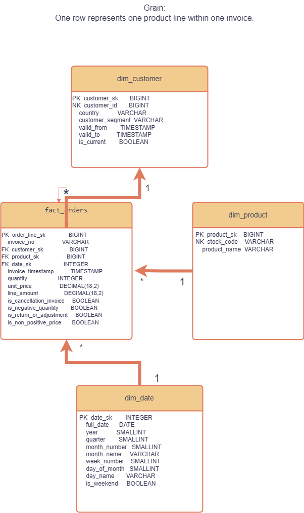
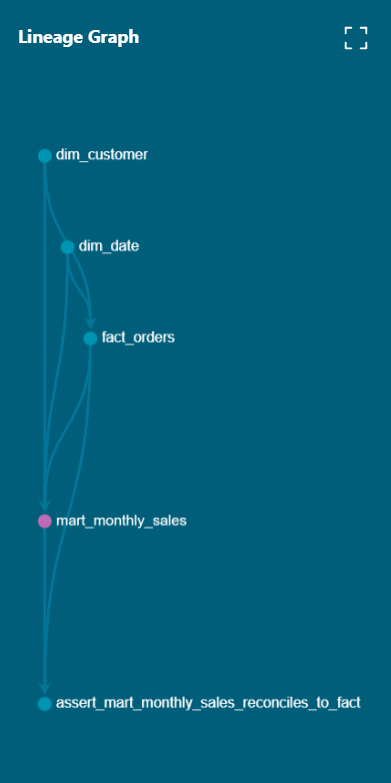

# Use Case 3 — Dimensional Data Modeling & Analytics Engineering with dbt

Bu proje, Online Retail II veri seti kullanılarak yıldız şema tasarımı, boyutsal veri modelleme, SCD Type 2 değişiklik takibi, dbt veri kalite testleri, dokümantasyon ve analytics mart geliştirme çalışmalarını kapsamaktadır.

Ham CSV verisi staging katmanında temizlenmiş, dimension ve fact tabloları oluşturulmuş, müşteri değişiklikleri tarihsel olarak takip edilmiş ve raporlamaya hazır bir aylık satış martı geliştirilmiştir.

---

## Projenin Amacı

Projenin temel amaçları:

- Ham perakende verisini analize hazır hâle getirmek
- Yıldız şema yaklaşımıyla fact ve dimension tabloları oluşturmak
- Müşteri değişikliklerini SCD Type 2 yöntemiyle saklamak
- dbt ile modüler ve tekrar çalıştırılabilir modeller geliştirmek
- Veri kalitesini otomatik testlerle doğrulamak
- dbt docs ve lineage graph ile veri akışını dokümante etmek
- Raporlamaya hazır bir analytics mart oluşturmak

---

## Kullanılan Teknolojiler

- Python
- dbt Core
- dbt-duckdb
- DuckDB
- SQL
- YAML
- Git ve GitHub
- Visual Studio Code
- Draw.io

---

## Veri Seti

Projede Online Retail II veri seti kullanılmıştır.

Ham veri konumu:

```text
use_case_3_modeling/data/raw/online_retail.csv
```

Ham CSV dosyası yaklaşık 95 MB büyüklüğünde olduğu için Git repository içerisine eklenmemiştir.

### Veri profilleme sonuçları

| Metrik | Sonuç |
|---|---:|
| Toplam ham satır | 1.067.371 |
| Benzersiz fatura | 53.628 |
| Benzersiz ürün | 5.305 |
| Benzersiz müşteri | 5.942 |
| Ülke sayısı | 43 |
| Boş Customer ID | 243.007 |
| İptal satırı | 19.494 |
| Fazladan exact duplicate satır | 34.335 |
| Minimum işlem tarihi | 2009-12-01 |
| Maksimum işlem tarihi | 2011-12-09 |

---

## Veri Akışı

```text
Online Retail CSV
        ↓
Raw Source
        ↓
Staging Models
        ↓
Dimensions ve Fact
        ↓
Analytics Mart
```

Projede bulunan başlıca modeller:

```text
stg_orders
stg_customers
stg_products

dim_customer
dim_product
dim_date

fact_orders

mart_monthly_sales
```

---

## Yıldız Şema

Yıldız şemanın merkezinde `fact_orders` tablosu bulunmaktadır.

### Fact tablosunun grain'i

> Bir satır, bir faturadaki tek bir ürün satırını temsil eder.

Fact tablosunda:

- Fatura numarası
- Müşteri anahtarı
- Ürün anahtarı
- Tarih anahtarı
- Miktar
- Birim fiyat
- Satır tutarı
- İptal ve iade işaretleri

bulunmaktadır.

### Dimension tabloları

#### `dim_customer`

Müşteri bilgilerini ve SCD Type 2 tarihsel versiyonlarını içerir.

#### `dim_product`

Her ürün kodu için tek bir ürün kaydı içerir.

#### `dim_date`

Veri setinin minimum ve maksimum tarihleri arasındaki kesintisiz takvim günlerini içerir.

---

## Natural Key ve Surrogate Key

Kaynak sistemden gelen iş anahtarları:

```text
customer_id
stock_code
invoice_no
```

Veri ambarında oluşturulan teknik anahtarlar:

```text
customer_sk
product_sk
date_sk
order_line_sk
```

`invoice_no`, ayrı bir dimension tablosu oluşturulmadan fact tablosunda tutulduğu için degenerate dimension olarak değerlendirilmiştir.

---

## SCD Type 2

Müşteri ülke ve segment değişikliklerini tarihsel olarak takip etmek amacıyla dbt snapshot kullanılmıştır.

Takip edilen alanlar:

```text
country
customer_segment
```

Bir müşteri bilgisi değiştiğinde:

1. Eski kayıt silinmez.
2. Eski kaydın geçerlilik bitiş zamanı doldurulur.
3. Yeni müşteri versiyonu eklenir.
4. Yeni versiyon güncel kayıt olarak işaretlenir.

Kontrollü test senaryosunda bir müşterinin segmenti:

```text
Standard → Premium
```

olarak değiştirilmiş ve iki tarihsel kayıt oluştuğu doğrulanmıştır.

Kullanılan tarihsel alanlar:

```text
valid_from
valid_to
is_current
customer_version_id
```

Müşteri bilgisi bulunmayan siparişler:

```text
customer_sk = -1
```

olan Unknown Customer kaydına bağlanmıştır.

---

## Staging Katmanı

### `stg_orders`

- Kolon isimlerini standartlaştırır.
- Veri tiplerini dönüştürür.
- Metin değerlerini temizler.
- Exact duplicate kayıtları kaldırır.
- `line_amount` değerini hesaplar.
- İptal ve iade işaretleri üretir.

Yardımcı alanlar:

```text
is_cancellation_invoice
is_negative_quantity
is_return_or_adjustment
is_non_positive_price
```

### `stg_customers`

- Boş Customer ID kayıtlarını kapsam dışı bırakır.
- Her müşteri için en güncel kaydı seçer.
- Customer snapshot modeline kaynak olur.

### `stg_products`

- Her ürün kodu için tek satır üretir.
- En güncel ve mümkünse boş olmayan ürün açıklamasını seçer.

---

## Analytics Mart

Aylık ve ülke bazında satış performansını raporlamak için:

```text
mart_monthly_sales
```

modeli oluşturulmuştur.

### Mart grain'i

> Bir satır, bir takvim ayı ve bir ülke kombinasyonunu temsil eder.

Mart içerisinde şu metrikler bulunmaktadır:

- Sipariş satırı sayısı
- Benzersiz fatura sayısı
- Benzersiz ürün sayısı
- Bilinen müşteri sayısı
- İptal faturası sayısı
- Satılan miktar
- İade veya düzeltme miktarı
- Brüt satış tutarı
- İade ve düzeltme tutarı
- Net satış tutarı

Mart toplamı ile fact tablosu toplamı karşılaştırılarak veri kaybı veya çift sayım olmadığı doğrulanmıştır.

---

## Veri Kalitesi Testleri

Projede şu dbt generic testleri kullanılmıştır:

```text
unique
not_null
relationships
accepted_values
```

Bu testlerle:

- Primary key benzersizliği
- Zorunlu alanların boş olmaması
- Fact ve dimension ilişkileri
- Müşteri segmenti değerleri
- Ay numarasının geçerli olması

kontrol edilmiştir.

Ayrıca fact ve mart toplamlarını karşılaştıran singular test oluşturulmuştur:

```text
tests/assert_mart_monthly_sales_reconciles_to_fact.sql
```

Kontrol edilen iş kuralı:

```text
SUM(fact_orders.line_amount)
=
SUM(mart_monthly_sales.net_sales_amount)
```

---

## Materialization Tercihleri

| Katman | Materialization |
|---|---|
| Staging | View |
| Dimension | Table |
| Fact | Table |
| Analytics mart | Table |
| Müşteri geçmişi | Snapshot |

Staging modelleri ara dönüşüm katmanı olduğu için view olarak oluşturulmuştur.

Dimension, fact ve analytics modelleri tekrar tekrar sorgulanacağı için table olarak oluşturulmuştur.

---

## Kurulum

Repository'yi klonlama:

```powershell
git clone https://github.com/TarikKarli/use-case-3-modeling.git
cd use-case-3-modeling
```

Sanal ortam oluşturma:

```powershell
python -m venv .venv
```

Sanal ortamı aktifleştirme:

```powershell
.\.venv\Scripts\Activate.ps1
```

Gerekli paketleri kurma:

```powershell
pip install dbt-core dbt-duckdb
```

Ham CSV dosyasını şu konuma yerleştirme:

```text
use_case_3_modeling/data/raw/online_retail.csv
```

dbt proje klasörüne geçme:

```powershell
cd .\use_case_3_modeling
```

Bağlantıyı doğrulama:

```powershell
dbt debug
```

---

## Projeyi Çalıştırma

Tüm modelleri ve testleri çalıştırmak için:

```powershell
dbt build
```

Analytics martı üst bağımlılıklarıyla çalıştırmak için:

```powershell
dbt build --select "+mart_monthly_sales"
```

Yalnızca modelleri çalıştırmak için:

```powershell
dbt run
```

Snapshot çalıştırmak için:

```powershell
dbt snapshot
```

Testleri çalıştırmak için:

```powershell
dbt test
```

---

## dbt Dokümantasyonu

Dokümantasyon dosyalarını üretmek için:

```powershell
dbt docs generate
```

Dokümantasyon sitesini açmak için:

```powershell
dbt docs serve --port 8080
```

Tarayıcı adresi:

```text
http://localhost:8080
```

Dokümantasyon sitesinde:

- Model açıklamaları
- Kolon açıklamaları
- Veri tipleri
- Testler
- Model bağımlılıkları
- Lineage graph

incelenebilir.

---

## Proje Görselleri

### Star Schema


### dbt Lineage



---

## Temel Modelleme Kararları

- Fact grain'i bir fatura ürün satırı olarak belirlenmiştir.
- Exact duplicate kayıtlar staging katmanında kaldırılmıştır.
- Negatif miktar ve iptal kayıtları silinmeden korunmuştur.
- Müşterisi bilinmeyen siparişler Unknown Customer kaydına bağlanmıştır.
- Müşteri geçmişi SCD Type 2 ile tutulmuştur.
- Fact ve müşteri dimension bağlantısı temporal join ile kurulmuştur.
- Analytics mart, aylık ve ülke bazında oluşturulmuştur.
- Fact ve mart toplamları otomatik test ile karşılaştırılmıştır.

---
---

## Karşılaşılan Sorunlar ve Çözümleri

### 1. Sanal ortam ve dbt çalıştırma yolu

Proje sırasında bazı terminallerde farklı bir use case'e ait sanal ortamın aktif olduğu görüldü. Ayrıca komutun repository kökünden veya dbt proje klasöründen çalıştırılmasına bağlı olarak `dbt.exe` dosyasının göreli yolu değişti.

Kullanılan yollar:

```text
Repository kökünden:
.\.venv\Scripts\dbt.exe

dbt proje klasöründen:
..\.venv\Scripts\dbt.exe

## Sonuç

Bu proje kapsamında ham perakende verisi, dbt kullanılarak modüler, test edilebilir ve dokümante edilmiş bir analitik veri modeline dönüştürülmüştür.

Proje sonunda:

- Yıldız şema oluşturuldu.
- Dimension ve fact modelleri geliştirildi.
- SCD Type 2 uygulandı.
- Veri kalite testleri eklendi.
- Aylık satış martı hazırlandı.
- Data dictionary ve lineage graph oluşturuldu.